# Screenshots Index

This directory contains screenshots for LocalNoteApp documentation.

## Application Screenshots

### Main Interface
Main application interface with note list and editor
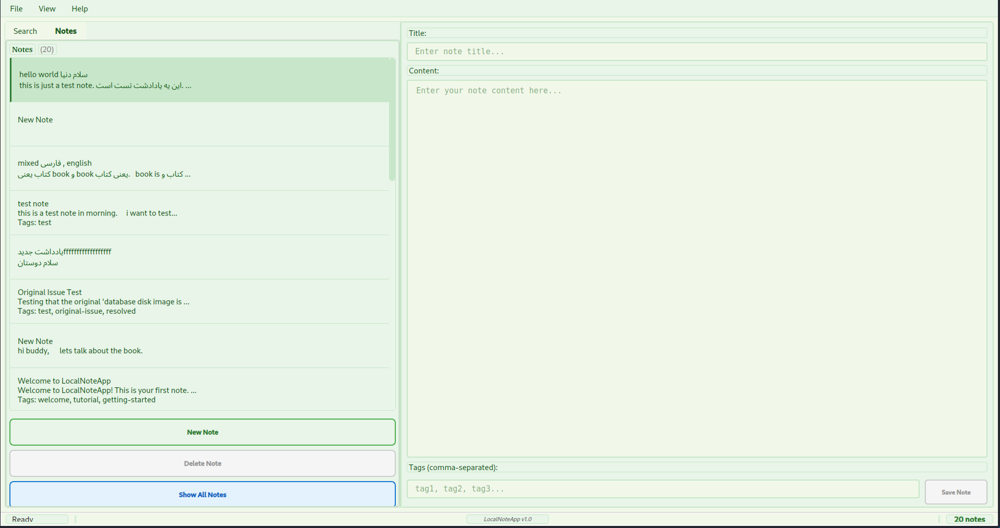

### New Note Dialog
Creating a new note
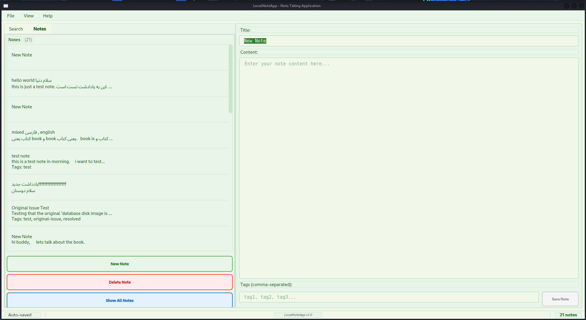

### Search Functionality
Basic search functionality
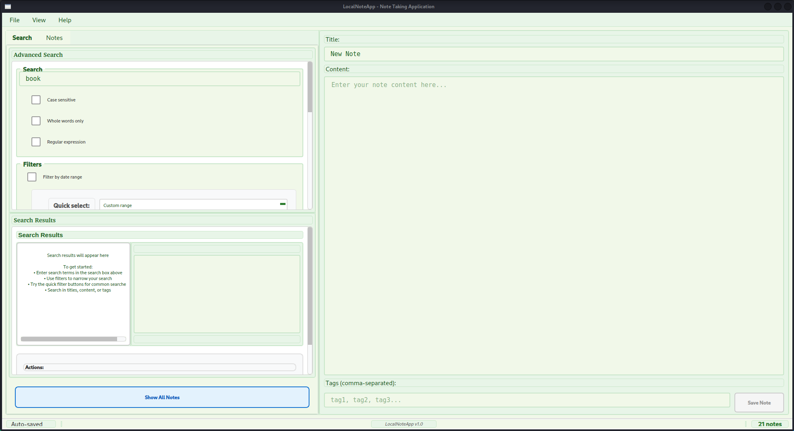

Advanced search dialog
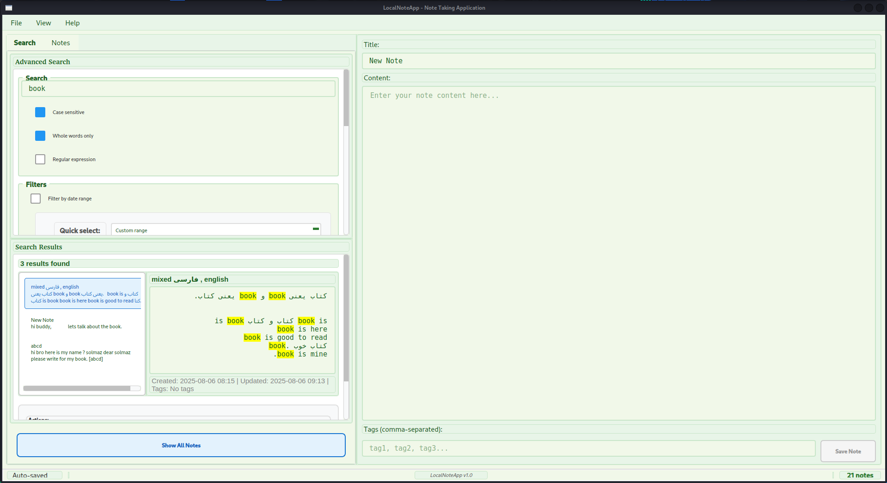

### Import/Export
Export notes dialog
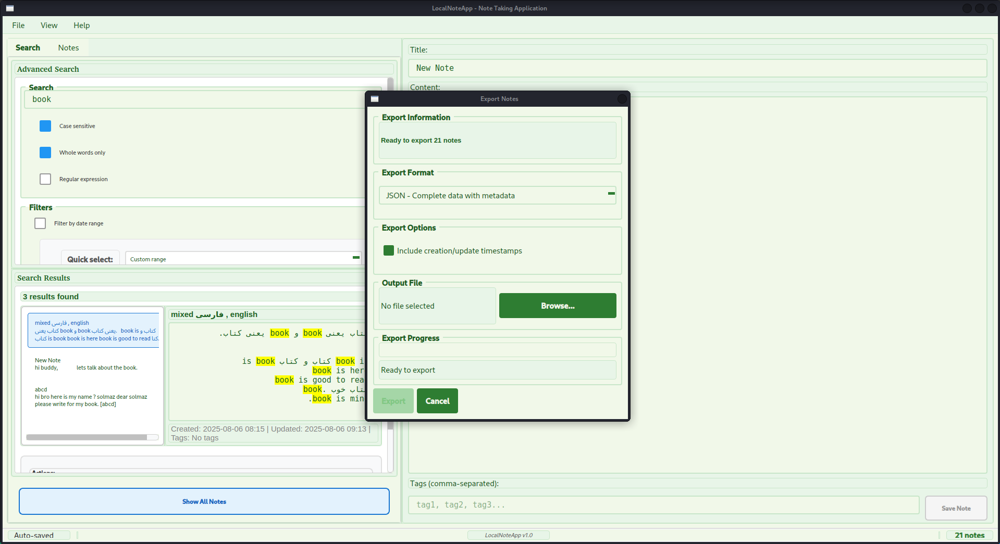

Import notes dialog
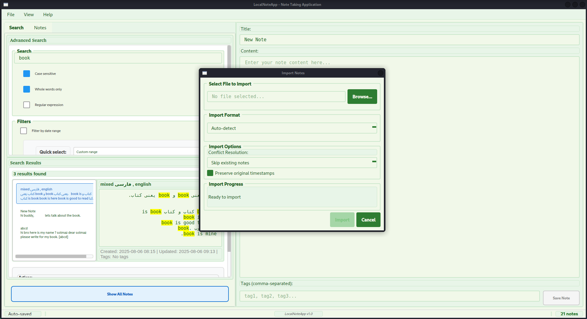

### Preferences
General preferences dialog
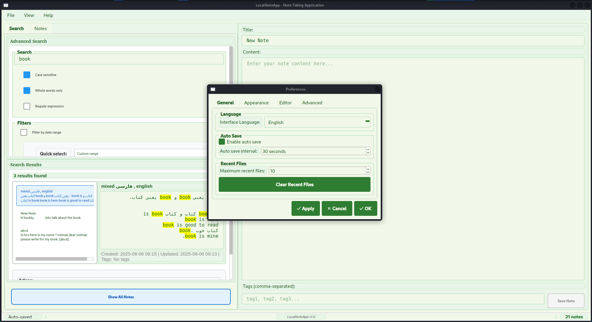

Theme preferences dialog
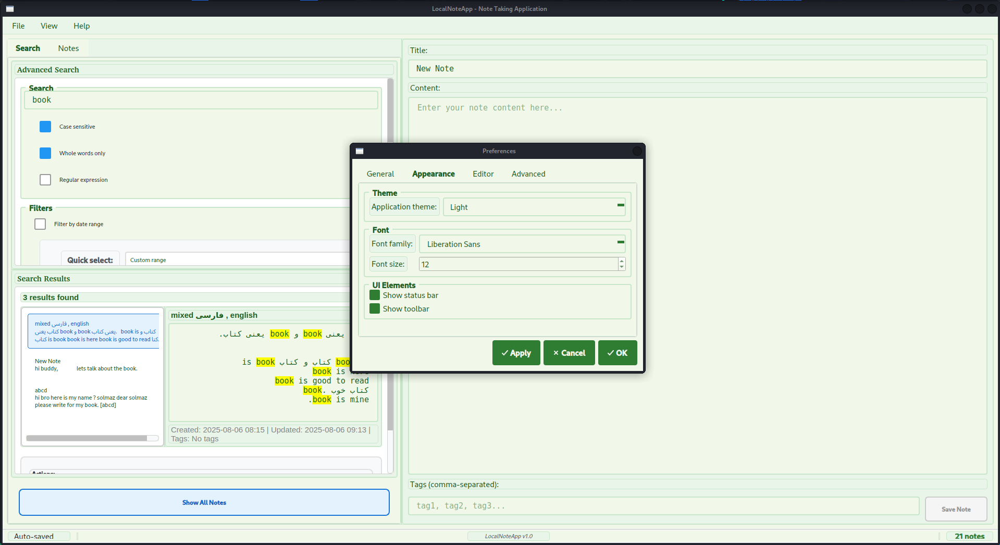

Language preferences dialog
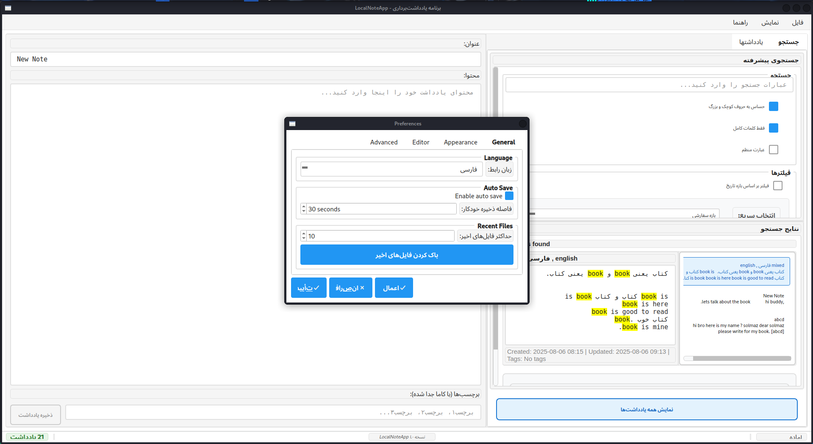

### Themes
Light theme appearance
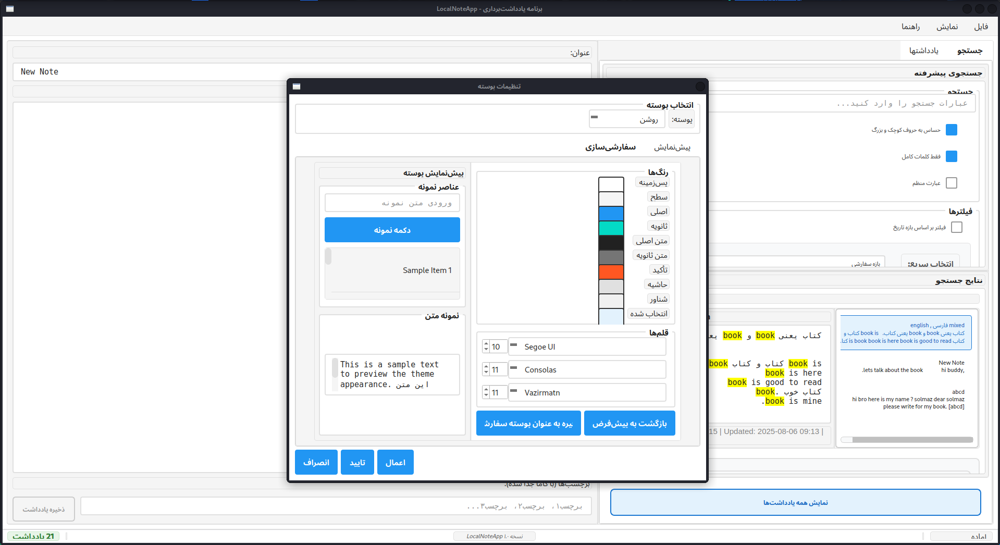

Dark theme appearance
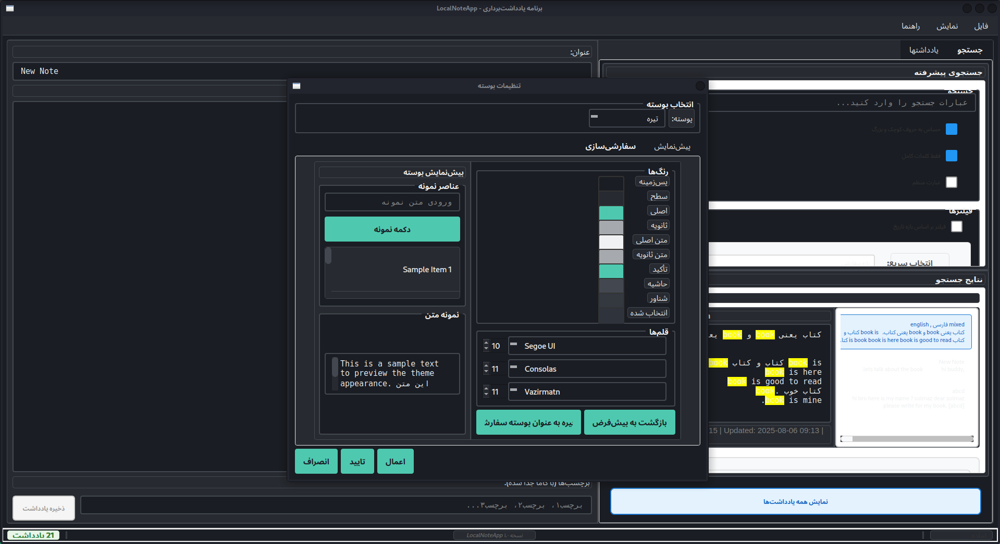

### Text Features
Bilingual text editing
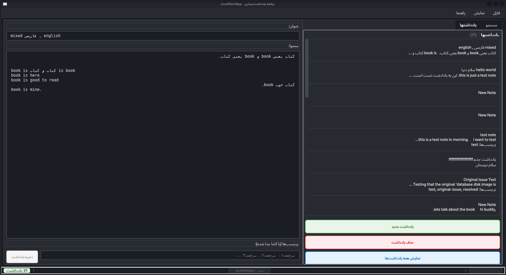

Right-to-left text direction

### Dialogs
About dialog
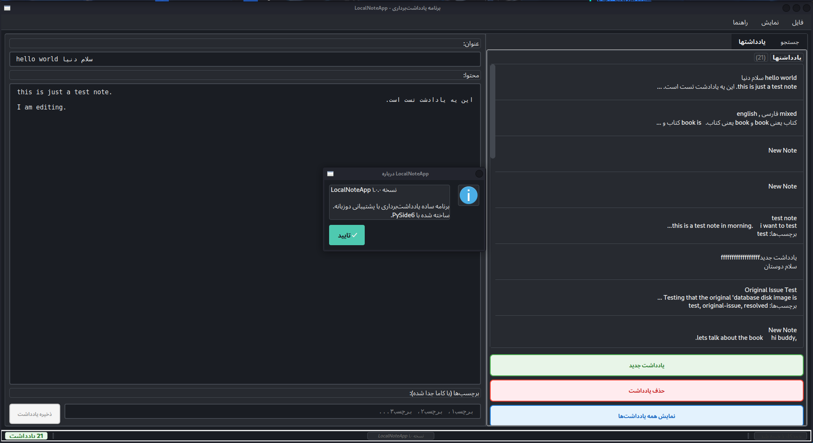

## Screenshot Status

| Name | Description | Status | File |
|------|-------------|--------|------|
| main_interface | Main application interface with note list and editor | ✅ Available | `main_interface.png` |
| new_note_dialog | Creating a new note | ✅ Available | `new_note_dialog.png` |
| search_basic | Basic search functionality | ✅ Available | `search_basic.png` |
| search_advanced | Advanced search dialog | ✅ Available | `search_advanced.png` |
| export_dialog | Export notes dialog | ✅ Available | `export_dialog.png` |
| import_dialog | Import notes dialog | ✅ Available | `import_dialog.png` |
| preferences_general | General preferences dialog | ✅ Available | `preferences_general.png` |
| preferences_themes | Theme preferences dialog | ✅ Available | `preferences_themes.png` |
| preferences_language | Language preferences dialog | ✅ Available | `preferences_language.png` |
| theme_light | Light theme appearance | ✅ Available | `theme_light.png` |
| theme_dark | Dark theme appearance | ✅ Available | `theme_dark.png` |
| bilingual_text | Bilingual text editing | ✅ Available | `bilingual_text.png` |
| rtl_text_direction | Right-to-left text direction | ✅ Available | `rtl_text_direction.png` |
| about_dialog | About dialog | ✅ Available | `about_dialog.png` |

## Guidelines

- All screenshots should be in PNG format
- Minimum resolution: 1920x1080
- Use consistent sample data across screenshots
- Follow the manual screenshot guide for instructions

## Manual Creation

Since automated screenshot capture requires a display environment, screenshots should be created manually following the instructions in `SCREENSHOT_GUIDE.md`.
